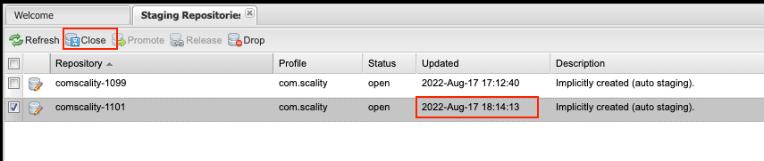
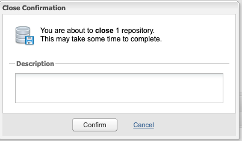
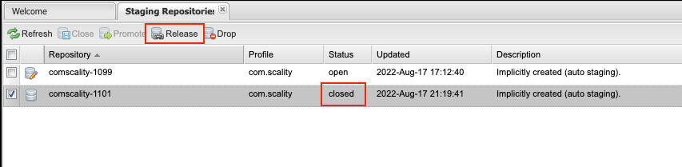
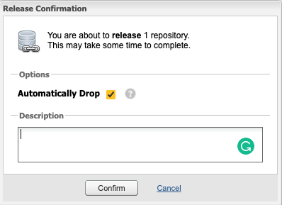

## vaultclient-java release

### Introduction

The artifacts of vaultclient-java project are stored in Nexus with the following metadata
```
Group ID : com.scality
artifact ID: vaultclient-java
```
We separate dev packages and released packages by having ``-SNAPSHOT`` suffix or not
in version, every git push operation will publish dev packages to [Nexus Snapshot Repositories](https://oss.sonatype.org/#view-repositories;snapshots~browsestorage),
dev snapshot packages can be overwritten all the time and 
can be directly used for testing in other projects.

But when we want to release a package, we will need to perform the following steps:

### Release Process

1. Check the project version in [build.gradle](../build.gradle#L19) and [vaultclient/build.gradle](../vaultclient/build.gradle#L17),
if the version specified is not the one you want to release, then make a PR to update it.


2. Run release workflow in the [github actions release page](https://github.com/scality/vaultclient-java/actions/workflows/release.yml).


3. Once the release workflow is complete successfully, proceed to Nexus Repository Manager to manually release the project.
   > We are doing this as currently OSIS and vaultlcient-java share the same namespace and to automate closing and 
   > releasesing all previous versions should be closed and released. Will be improved in the future. 
   
    Nexus Repo link: https://oss.sonatype.org

    For login credentials, they are stored in github secrets or can be obtained by emailing Object Squad <object-squad@scality.com>
    
   

4. Go to [Staging Repositories](https://oss.sonatype.org/#stagingRepositories), 
find the latest record which should correspond to the github action release workflow time
   
   


5. Click **Close** button, fill in **Description** and click **Confirm** to start the Close process.

   


6. Once Close process is complete successfully, you should be able to see the status of 
this record is closed and the **Release** button is active.

   


7. Click **Release** button, fill in **Description** and click ***Confirm** to start the Release process.

   


8. Once Release process is complete successfully, you should be able to see this new released package in [Nexus](https://oss.sonatype.org/#nexus-search;quick~vaultclient).
